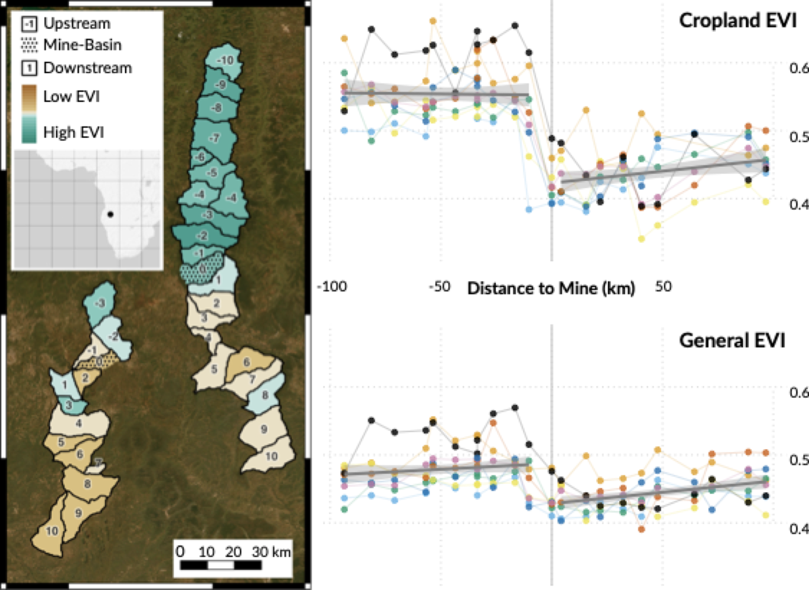
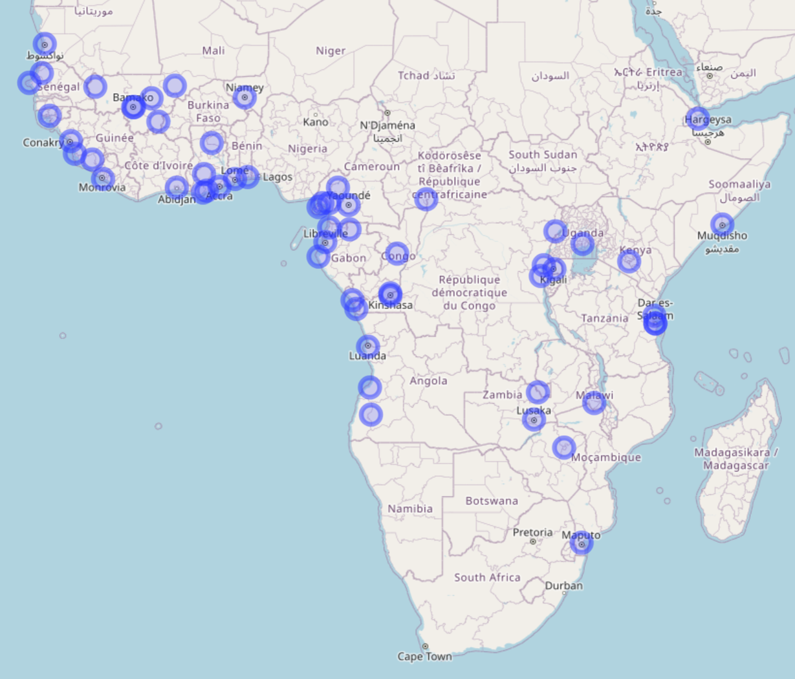

# Hi!

I’m a first-year **PhD student** in the Department of Economics at the **University of Zurich**. My research examines the environmental and social consequences of mining. I use spatial data, especially **satellite imagery**, and applied microeconomic research designs to study questions in low and middle-income countries. Recently, I have been expanding into experimental economics and designing experiments to shed light on topics in political economy. More broadly, I’m interested in **environmental economics**, **applied econometrics**, and **political economy**, and I’m eager to learn about new fields and methods.

Feel free to reach out at [gustav.pirich@econ.uzh.ch](mailto:gustav.pirich@econ.uzh.ch).

# Research

**Downstream Impacts of Mines on Agriculture in Africa**
with Lukas Vashold, Maximilian Heinze, & Nikolas Kuschnig
***Journal of Development Economics***, *179*, 103671. [https://doi.org/10.1016/j.jdeveco.2025.103671](https://doi.org/10.1016/j.jdeveco.2025.103671)
[Click here for the VoxDev article](https://voxdev.org/topic/agriculture/downstream-impacts-mines-how-pollution-hits-agriculture)

+ Abstract & Figure

 

Mining operations in Africa are expanding rapidly, creating negative externalities that remain poorly understood. In this paper, we provide causal evidence for the impact of water pollution from mines on downstream vegetation and agriculture across the continent. We exploit a natural experiment, where mines cause a discontinuity in water pollution along river networks, to compare vegetation health in upstream and downstream locations. We find that mines significantly reduce peak vegetation downstream by 1.3–1.5%, impairing the productivity of over 74,000 km² of croplands. These reductions correspond to annual losses of 91,000–205,000 tons of cereal crops in the immediate vicinity alone, with particularly severe effects in fertile regions and areas where gold mining predominates. Our findings highlight substantial externalities of mining and demonstrate an urgent need for oversight and regulation.

 

Example of two Angolan mine sites (dotted, and labeled with '0') and their upstream and downstream basin systems (left), as well as measurements of the Enhanced Vegetation Index (EVI) for croplands and general vegetation over the years 2016, 2017, 2018, 2019, 2020, 2021, 2022, and 2023 along the larger basin system (right).

---

**The Local Economic Impact of China's Stadium Diplomacy in Sub-Saharan Africa**
with Valentin Lindlacher
***World Development***, *185*, 106765. [https://doi.org/10.1016/j.worlddev.2024.106765](https://doi.org/10.1016/j.worlddev.2024.106765)
Discussion: [The Diplomat](https://thediplomat.com/2025/01/chinas-stadium-diplomacy-in-africa-pt-1-the-talanta-sports-stadium-in-nairobi/)

+ Abstract & Figure

 

This study investigates the economic impact of China's "stadium diplomacy" in Sub-Saharan Africa. Exploiting the staggered timing of the construction in a difference-in-differences framework, we analyze the effect of Chinese-built and financed stadiums on local economic development. Employing nighttime light satellite data, we provide both an aggregate and spatially disaggregated assessment of these investments. We find that a stadium's city nighttime light intensity increases by about 24 percent, on average, after stadium completion. The effects can be attributed to the stadiums but are not only visible close to the stadium's location. Estimates on nighttime light activity are mirrored by individual-level employment effects in the stadiums' surrounding area. For stadiums not built or financed by China, we cannot find similar effects. Our results contrast with the widely held notion that China's development finance projects constitute "white elephants".

 

Location of sports stadiums financed and constructed by China in Africa.

---

# Work in Progress

**Gold Mining and Schooling in Ghana**

---

---
